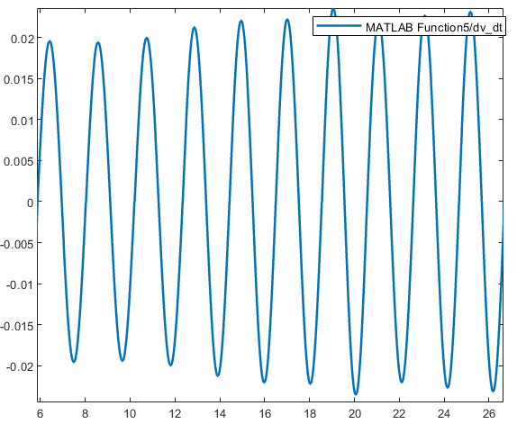
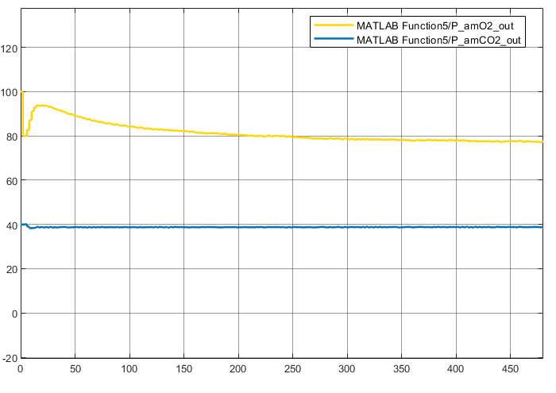
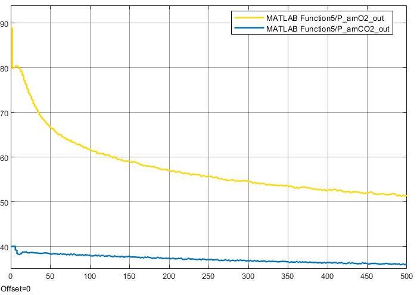
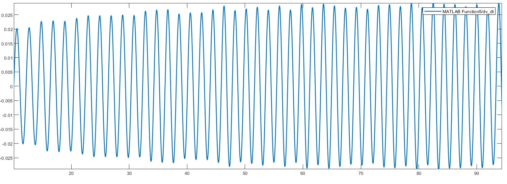
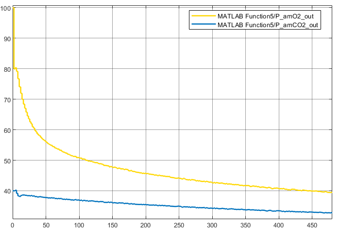
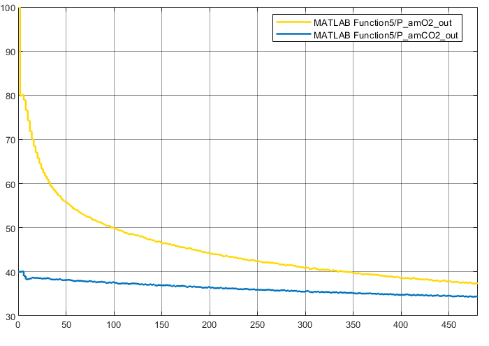
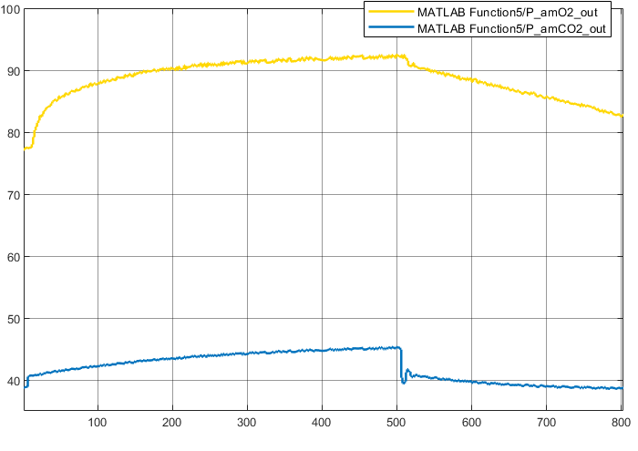

# Closed-Loop Neonatal Respiratory Control System Simulation

[](https://www.mathworks.com/products/simulink.html)
[](docs/report.pdf)
[](LICENSE)

A complete **MATLAB / Simulink** re-implementation, verification, and physiological validation of **Dr. Fleur T. Tehrani's** closed-loop mathematical model for the respiratory control system in newborn infants. 

This repository models the nonlinear chemical feedback, gas-exchange kinetics in vital tissues, and dynamic neural drive across baseline resting state, hypoxia, and hypercapnia conditions.

---

## 📑 Table of Contents
- [Project Overview](#-project-overview)
- [System Architecture](#-system-architecture)
- [Mathematical Modeling & Governing Equations](#-mathematical-modeling--governing-equations)
- [Physiological Test Scenarios & Results](#-physiological-test-scenarios--results)
- [Validation & Steady-State Results](#-validation--steady-state-results)
- [Repository Structure](#-repository-structure)
- [Getting Started & How to Run](#-getting-started--how-to-run)
- [References](#-references)

---

## 🔬 Project Overview

Biological control mechanisms feature complex inter-organ delays, nonlinear feedback gains, and time-varying respiratory demands. This project models the complete closed-loop neonatal respiratory control loop:

1. **Reproduction of Dr. Tehrani's Reference Model:** Mapping continuous differential mass-balance equations and discrete control algorithms into an integrated Simulink model.
2. **State-Variable Stabilization:** Resolving blood gas partial pressures ($P_{amO_2}, P_{amCO_2}, P_{cCO_2}$) and ventilation parameters ($V_A, V_D, V_E, f$) until reaching steady-state ($t = 8\text{ minutes}$).
3. **Stress Testing Under Physiological Disorders:** Evaluating compensation responses against acute Hypoxia ($O_2$ drop) and Hypercapnia ($CO_2$ inhalation), alongside tuning the work-minimization weighting parameter ($\mu$).

---

## 🏛 System Architecture

The overall closed-loop architecture is decoupled into two interacting blocks:

```
                            ┌───────────────────────────────────┐
                            │    Brainstem Neural Controller    │
                            │       (Discrete Controller)       │
                            └─────────────────┬─────────────────┘
                                              │ Flow Demand (dv/dt)
                                              ▼
  ┌───────────────────────────────────────────────────────────────────────────────────┐
  │                                  Plant Subsystem                                  │
  │                                                                                   │
  │     ┌─────────────┐   Arterial Blood   ┌─────────────┐   Venous Return            │
  │     │    Lungs    ├───────────────────►│ Body Tissue ├──────────────────┐          │
  │     └──────┬──────┘                    └─────────────┘                  │          │
  │            │                                                            ▼          │
  │            │  Arterial Blood           ┌─────────────┐  Venous  ┌───────────────┐ │
  │            └──────────────────────────►│Brain Tissue ├─────────►│  CSF Chamber  │ │
  │                                        └─────────────┘          └───────┬───────┘ │
  └───────────────────────────────────────────────┬─────────────────────────┼─────────┘
                                                  │                         │
                               Peripheral Drives  │      Central Drive      │
                           (PamO2, PamCO2 feedback)      (PcCO2 feedback)   │
                                                  ▼                         ▼
                                       To Brainstem Controller
```

### 1. Brainstem Controller Subsystem (Discrete Controller)
To maximize numerical solver stability and handle discrete-time variables, five primary regulatory modules are integrated into a single high-performance subsystem:
* **Mean Value Detector:** Filters instantaneous oscillating pressures to extract running mean metabolic signals.
* **Clock Pulse Generator & Signal Generator:** Generates the physiological pacing rhythm and breathing profiles ($dv/dt$).
* **Frequency Optimizer:** Dynamically tunes respiratory rate ($f$) by minimizing the work expenditure of breathing based on the optimization factor $\mu$.
* **Ventilation Controller:** Modulates tidal volume ($V_T$) and minute ventilation ($V_E$) driven by central and peripheral chemical errors.

### 2. Plant Subsystem (Gas Exchange & Circulation Dynamics)
Implemented via embedded MATLAB functions interconnected with numerical integrators:
* **Lungs:** Transports external airflow into alveolar spaces, executing gas exchange with pulmonary capillary blood.
* **Body Tissue:** Represents system organs consuming $O_2$ and dumping $CO_2$ into systemic venous circulation.
* **Brain Tissue:** Models metabolic cerebral kinetics and transfers venous blood toward cerebrospinal fluid structures.
* **Cerebrospinal Fluid (CSF):** Computes $P_{cCO_2}$, acting as the primary feedback stimulator for central chemoreceptors.

---

## 📐 Mathematical Modeling & Governing Equations

Dynamic concentrations are governed by mass-balance differential equations. As an example, the governing equations for the **Body Tissue** compartment are formulated as:

$$\frac{dC_{TCO_2}}{dt} = \frac{C_{amCO_2} \cdot Q_T + MR_{TCO_2} - C_{VTCO_2} \cdot Q_T}{S_T}$$

$$\frac{dC_{TO_2}}{dt} = \frac{C_{amO_2} \cdot Q_T - MR_{TO_2} - C_{VTO_2} \cdot Q_T}{S_T}$$

Where:
* $Q_T = 9.8 \times 10^{-3} \text{ l/s}$: Total cardiac blood flow rate.
* $MR_{TCO_2} = 1.625 \times 10^{-4} \text{ l/s}$: Metabolic rate of $CO_2$ generation in body tissues.
* $MR_{TO_2} = 1.902 \times 10^{-4} \text{ l/s}$: Metabolic rate of $O_2$ consumption in body tissues.
* $S_T = 0.9 \text{ l}$: Effective storage volume factor for tissue compartments.
* $C_{am}$ and $C_{VT}$: Mixed arterial and venous gas concentrations, respectively.

---

## 📊 Physiological Test Scenarios & Results

### 1. Resting Conditions ($F_{I_{O_2}} = 21\%$, $F_{I_{CO_2}} = 0\%$)
The system demonstrates natural respiratory pacing with peak airflow amplitudes around $0.04 \text{ l/s}$. Arterial partial pressures settle stably at $P_{amO_2} \approx 78.0\text{ mmHg}$ and $P_{amCO_2} \approx 38.8\text{ mmHg}$.

<p align="center">
  
  
  <br>
  <em>Figure 1: Resting-state airflow oscillation (left) and stabilization trajectories of arterial partial pressures (right).</em>
</p>

---

### 2. Hypoxia Conditions ($F_{I_{O_2}} = 15\%$ & $12\%$)
Under ambient oxygen deprivation, the brainstem issues hyperventilation commands to compensate for arterial desaturation. 
* As $F_{I_{O_2}}$ falls to $12\%$, minute ventilation ($V_E$) ramps up from $0.589\text{ l/s}$ to $0.940\text{ l/s}$.
* **Role of parameter $\mu$:** Adjusting the mechanical breathing work penalty $\mu$ (from $1.0$ down to $0.5$) demonstrates the trade-off between chemical error tolerance and breathing workload.

<p align="center">
  
  
  <br>
  <em>Figure 2: Dynamic arterial response to acute hypoxia (left) and increased respiratory airflow amplitude reflecting hyperventilation (right).</em>
</p>

<p align="center">
  
  
  <br>
  <em>Figure 3: Influence of work weighting coefficient mu on system sensitivity during 12% hypoxia (Left: mu=0.8, Right: mu=0.5).</em>
</p>

---

### 3. Hypercapnia & Recovery Dynamics ($F_{I_{CO_2}} = 5\%$)
A time-varying challenge where $5\%\ CO_2$ was applied between $t = 0\text{s}$ and $t = 500\text{s}$, followed by ambient recovery:
* **Stimulation Phase ($0 - 500\text{s}$):** Inhaled $CO_2$ triggers deep, rapid breathing. Elevated ventilation increases $P_{amO_2}$ past $90\text{ mmHg}$, while arterial $P_{amCO_2}$ rises gently to approximately $45\text{ mmHg}$.
* **Recovery Phase ($t > 500\text{s}$):** Removing external $CO_2$ causes rapid gas wash-out, producing an immediate drop in $P_{amCO_2}$ accompanied by minor damped oscillations before resetting to baseline.

<p align="center">
  
  <br>
  <em>Figure 4: Dynamic dual-phase response and wash-out recovery trajectory under 5% CO2 hypercapnia challenge (mu = 0.8).</em>
</p>

---

## 📈 Validation & Steady-State Results

Simulations were integrated for $8\text{ minutes}$ using variable-step stiff ODE solvers (`ode45` / `ode15s`) to extract true steady-state values:

| Physiological State | $F_{I_{O_2}}$ | $F_{I_{CO_2}}$ | $\mu$ | $P_{amO_2}$ (mmHg) | $P_{amCO_2}$ (mmHg) | $P_{cCO_2}$ (mmHg) | $V_A$ (l/s) | $V_D$ (l/s) | $V_E$ (l/s) | $f$ (bpm) |
|:---:|:---:|:---:|:---:|:---:|:---:|:---:|:---:|:---:|:---:|
| **Resting Condition** | 0.21 | 0.00 | 1.0 | 78.0 | 38.8 | 43.7 | 0.478 | $3.63 \times 10^{-3}$ | 0.589 | 30.5 |
| **Hypoxia** | 0.15 | 0.00 | 1.0 | 51.7 | 36.0 | 41.8 | 0.560 | $3.86 \times 10^{-3}$ | 0.684 | 32.2 |
| | 0.15 | 0.00 | 0.8 | 50.9 | 36.5 | 42.1 | 0.563 | $3.87 \times 10^{-3}$ | 0.688 | 32.3 |
| | 0.15 | 0.00 | 0.5 | 49.7 | 37.2 | 42.6 | 0.542 | $3.81 \times 10^{-3}$ | 0.663 | 31.9 |
| | 0.12 | 0.00 | 1.0 | 40.6 | 31.9 | 38.8 | 0.780 | $4.49 \times 10^{-3}$ | 0.940 | 35.7 |
| | 0.12 | 0.00 | 0.8 | 39.5 | 32.7 | 39.5 | 0.732 | $4.35 \times 10^{-3}$ | 0.884 | 35.0 |
| | 0.12 | 0.00 | 0.5 | 37.4 | 34.4 | 40.7 | 0.666 | $4.17 \times 10^{-3}$ | 0.808 | 34.1 |
| **Hypercapnia** | 0.21 | 0.03 | 1.0 | 88.5 | 41.3 | 45.5 | 0.913 | $4.87 \times 10^{-3}$ | 1.095 | 37.3 |
| | 0.21 | 0.03 | 0.8 | 88.6 | 41.3 | 45.5 | 0.924 | $4.90 \times 10^{-3}$ | 1.107 | 37.4 |
| | 0.21 | 0.03 | 0.5 | 88.6 | 41.3 | 45.6 | 0.921 | $4.89 \times 10^{-3}$ | 1.104 | 37.3 |
| | 0.21 | 0.05 | 1.0 | 91.9 | 45.0 | 48.5 | 1.604 | $6.82 \times 10^{-3}$ | 1.891 | 42.2 |
| | 0.21 | 0.05 | 0.8 | 92.2 | 45.2 | 48.5 | 1.632 | $6.90 \times 10^{-3}$ | 1.924 | 42.3 |
| | 0.21 | 0.05 | 0.5 | 92.5 | 45.3 | 48.6 | 1.666 | $6.99 \times 10^{-3}$ | 1.963 | 42.5 |

---

## 📁 Repository Structure

```text
neonatal-respiratory-control-simulink/
│
├── simulink/
│   └── infant_respiratory_model.slx   # Complete standalone Simulink closed-loop model
│
├── docs/
│   ├── report.pdf                      # Compiled project report
│   ├── presentation.pdf                # Presentation slides
│   ├── presentation.pptx               # PowerPoint source
│   ├── tehrani_reference_paper.pdf     # Reference literature
│   ├── report_latex/                   # XeLaTeX source code
│   └── images/                         # Simulation output graphs
│       ├── rdvdt2.png
│       ├── rp1.png
│       ├── o2p15.png
│       ├── o2dvdt1.png
│       ├── o2p12_8.png
│       ├── o2p12_5.png
│       └── co2p5_8.png
│
├── .gitignore
├── LICENSE
└── README.md
```

---

## ⚡ Getting Started & How to Run

### Prerequisites
* **MATLAB & Simulink** (R2021a or newer recommended).

### Running the Model
All physiological constants, initial state conditions, and mass-balance equations are embedded directly inside the model's subsystem masks and MATLAB function blocks:

1. Clone or download this repository.
2. Open MATLAB and navigate to the project directory.
3. Open the model file in Simulink:
   ```matlab
   open_system('simulink/infant_respiratory_model.slx');
   ```
4. Click the **Run** button on the Simulink toolbar (or run `sim('simulink/infant_respiratory_model.slx')` in the command window).
5. Open the Scope blocks to view real-time blood gas partial pressures and airflow waveforms.

---

## 📖 References
* **Reference Paper:** Tehrani, Fleur T. *"A mathematical model of the respiratory control system in the newborn infant."*
* **Course:** Biological System Modeling, Department of Electrical Engineering, Sharif University of Technology.

---

## 📜 License
This project is licensed under the MIT License - see the [LICENSE](LICENSE) file for details.
