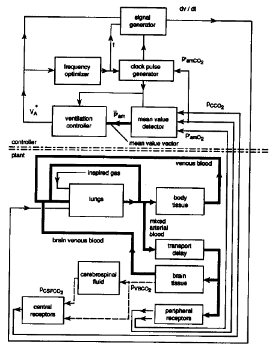
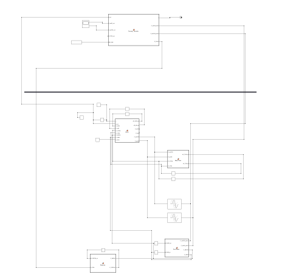
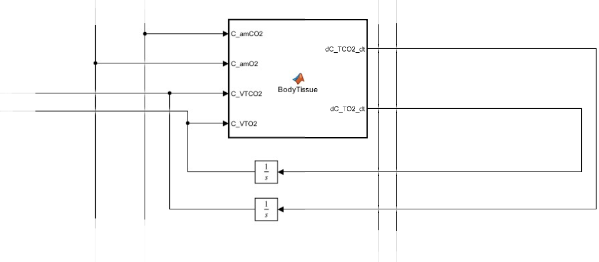
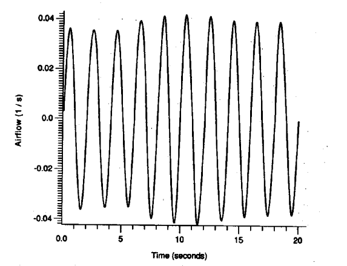
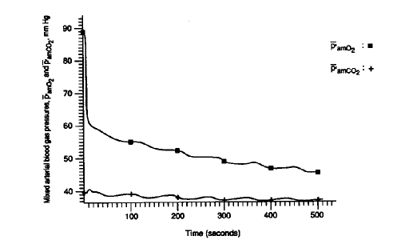
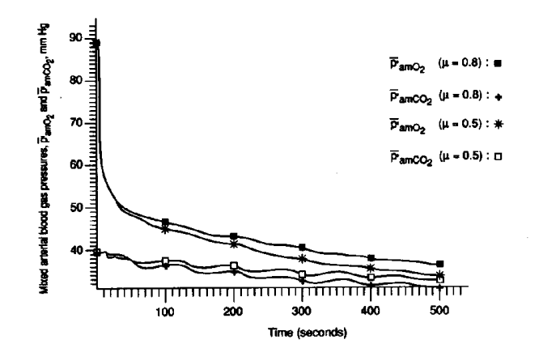
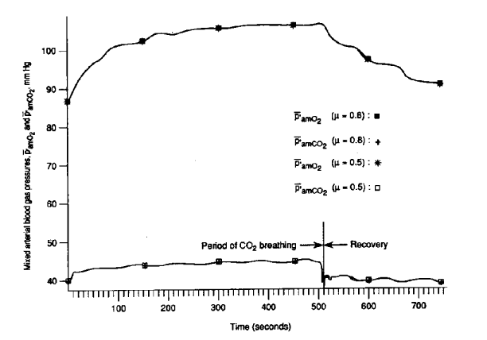
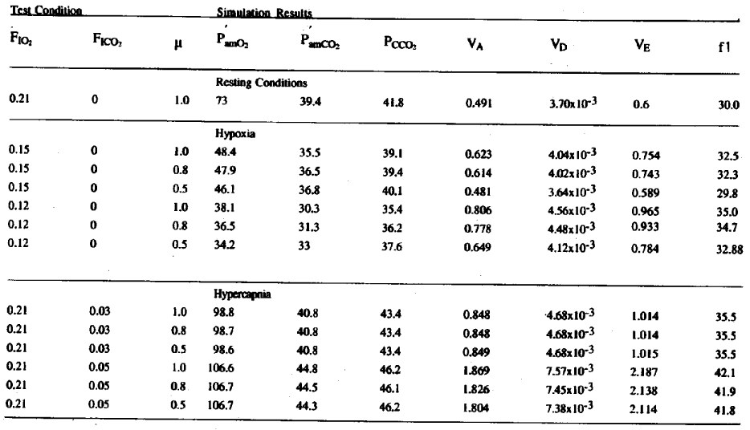

# Closed-Loop Neonatal Respiratory Control System Simulation

[](https://www.mathworks.com/products/simulink.html)
[](docs/report.pdf)
[](LICENSE)

A complete **MATLAB / Simulink** re-implementation, verification, and physiological validation of **Dr. Fleur T. Tehrani's** closed-loop mathematical model for the respiratory control system in newborn infants. 

This repository models nonlinear chemical feedback, tissue gas-exchange kinetics, and dynamic neural drive across resting state, hypoxia, and hypercapnia conditions.

---

## 📑 Table of Contents
- [Project Overview](#-project-overview)
- [System Architecture Comparison](#-system-architecture-comparison)
- [Mathematical Modeling](#-mathematical-modeling)
- [Side-by-Side Physiological Validation](#-side-by-side-physiological-validation)
  - [1. Resting State Airflow & Blood Gases](#1-resting-state-airflow--blood-gases)
  - [2. Hypoxia Challenge (15% & 12% O2)](#2-hypoxia-challenge-15--12-o2)
  - [3. Hypercapnia & Wash-out Recovery (5% CO2)](#3-hypercapnia--wash-out-recovery-5-co2)
- [Validation & Steady-State Results](#-validation--steady-state-results)
- [Repository Structure](#-repository-structure)
- [How to Run](#-how-to-run)
- [References](#-references)

---

## 🔬 Project Overview

Biological control mechanisms feature complex inter-organ delays, nonlinear feedback gains, and time-varying respiratory demands. This project models the complete closed-loop neonatal respiratory control loop:

1. **Reproduction of Dr. Tehrani's Reference Model:** Mapping continuous differential mass-balance equations and discrete control algorithms into an integrated Simulink framework.
2. **State-Variable Stabilization:** Resolving blood gas partial pressures ($P_{amO_2}, P_{amCO_2}, P_{cCO_2}$) and ventilation parameters ($V_A, V_D, V_E, f$) until reaching steady-state ($t = 8\text{ minutes}$).
3. **Stress Testing Under Physiological Disorders:** Evaluating compensation responses against acute Hypoxia ($O_2$ drop) and Hypercapnia ($CO_2$ inhalation), alongside tuning the work-minimization weighting parameter ($\mu$).

---

## 🏛 System Architecture Comparison

The closed-loop architecture is decoupled into a discrete neural controller (brainstem) and continuous metabolic plant compartments:

<table>
  <tr>
    <th width="50%" align="center">Reference Paper Conceptual Model</th>
    <th width="50%" align="center">Implemented Simulink Model</th>
  </tr>
  <tr>
    <td></td>
    <td></td>
  </tr>
</table>

### 1. Brainstem Controller Subsystem (Discrete Controller)
Integrates five regulatory modules into a unified discrete-time block for maximum solver stability:
* **Mean Value Detector:** Filters instantaneous oscillating pressures to extract running mean metabolic indicators.
* **Clock Pulse & Signal Generator:** Generates breathing pacing profiles ($dv/dt$).
* **Frequency Optimizer:** Tunes respiratory rate ($f$) to minimize mechanical work expenditure based on weighting factor $\mu$.
* **Ventilation Controller:** Adjusts tidal volume ($V_T$) and minute ventilation ($V_E$) driven by chemical error signals.

### 2. Plant Subsystem (Gas Exchange & Circulation Dynamics)
Realized through custom MATLAB function blocks driving numerical integrators:
* **Lungs:** Facilitates gas exchange between inspired air and pulmonary blood flow.
* **Body Tissue:** Consumes $O_2$ and produces metabolic $CO_2$.
* **Brain Tissue & CSF:** Interacts chemically with cerebral blood flow and produces central feedback ($P_{cCO_2}$).

---

## 📐 Mathematical Modeling

The dynamic mass balance for body tissue gas concentration is expressed as:

$$\frac{dC_{TCO_2}}{dt} = \frac{C_{amCO_2} \cdot Q_T + MR_{TCO_2} - C_{VTCO_2} \cdot Q_T}{S_T}$$

$$\frac{dC_{TO_2}}{dt} = \frac{C_{amO_2} \cdot Q_T - MR_{TO_2} - C_{VTO_2} \cdot Q_T}{S_T}$$

Where $Q_T = 9.8 \times 10^{-3}\ \text{l/s}$, $MR_{TCO_2} = 1.625 \times 10^{-4}\ \text{l/s}$, $MR_{TO_2} = 1.902 \times 10^{-4}\ \text{l/s}$, and $S_T = 0.9\ \text{l}$.

<p align="center">
  
  <br>
  <em>Simulink block implementation of the Body Tissue differential mass-balance subsystem.</em>
</p>

---

## 📊 Side-by-Side Physiological Validation

### 1. Resting State Airflow & Blood Gases
Under normal baseline conditions ($F_{I_{O_2}} = 21\%, F_{I_{CO_2}} = 0\%$), the simulator tracks reference oscillating airflow patterns with peak amplitudes near $0.04\text{ l/s}$.

<table>
  <tr>
    <th width="50%" align="center">Reference Airflow Waveform</th>
    <th width="50%" align="center">Simulink Airflow Waveform</th>
  </tr>
  <tr>
    <td></td>
    <td></td>
  </tr>
</table>

<p align="center">
  
  <br>
  <em>Stabilization trajectories of arterial partial pressures toward resting equilibrium.</em>
</p>

---

### 2. Hypoxia Challenge (15% & 12% O2)

#### 15% Hypoxia Test
A step drop in ambient $O_2$ activates the neural drive, resulting in hyperventilation to restore arterial oxygen levels:

<table>
  <tr>
    <th width="50%" align="center">Reference Trajectory (15% Hypoxia)</th>
    <th width="50%" align="center">Simulink Output (15% Hypoxia, μ = 0.5)</th>
  </tr>
  <tr>
    <td></td>
    <td></td>
  </tr>
</table>

#### 12% Hypoxia & Influence of Weighting Parameter $\mu$
Adjusting $\mu$ demonstrates the trade-off between breathing mechanical work and chemical regulation error:

<p align="center">
  
  <br>
  <em>Reference paper trajectory under 12% hypoxia.</em>
</p>

<table>
  <tr>
    <th width="50%" align="center">Simulink Model (μ = 0.8)</th>
    <th width="50%" align="center">Simulink Model (μ = 0.5)</th>
  </tr>
  <tr>
    <td></td>
    <td></td>
  </tr>
</table>

<p align="center">
  
  <br>
  <em>Compensatory increase in respiratory airflow amplitude during acute hypoxia.</em>
</p>

---

### 3. Hypercapnia & Wash-out Recovery (5% CO2)
A time-varying experiment where $5\%\ CO_2$ was delivered from $t = 0\text{ s}$ to $t = 500\text{ s}$, followed by an atmospheric wash-out phase:

<table>
  <tr>
    <th width="50%" align="center">Reference Hypercapnia & Recovery</th>
    <th width="50%" align="center">Simulink Hypercapnia & Recovery (μ = 0.8)</th>
  </tr>
  <tr>
    <td></td>
    <td></td>
  </tr>
</table>

---

## 📈 Validation & Steady-State Results

Simulations were integrated for $8\text{ minutes}$ using variable-step stiff ODE solvers (`ode45` / `ode15s`) to extract steady-state values.

<p align="center">
  
  <br>
  <em>Steady-state benchmark values reported in Dr. Tehrani's paper (Table 1).</em>
</p>

### Simulation Results Table

| Physiological State | $F_{I_{O_2}}$ | $F_{I_{CO_2}}$ | $\mu$ | $P_{amO_2}$ (mmHg) | $P_{amCO_2}$ (mmHg) | $P_{cCO_2}$ (mmHg) | $V_A$ (l/s) | $V_D$ (l/s) | $V_E$ (l/s) | $f$ (bpm) |
| :--- | :---: | :---: | :---: | :---: | :---: | :---: | :---: | :---: | :---: | :---: |
| **Resting Condition** | 0.21 | 0.00 | 1.0 | 78.0 | 38.8 | 43.7 | 0.478 | 0.0036 | 0.589 | 30.5 |
| **Hypoxia** | 0.15 | 0.00 | 1.0 | 51.7 | 36.0 | 41.8 | 0.560 | 0.0038 | 0.684 | 32.2 |
| | 0.15 | 0.00 | 0.8 | 50.9 | 36.5 | 42.1 | 0.563 | 0.0038 | 0.688 | 32.3 |
| | 0.15 | 0.00 | 0.5 | 49.7 | 37.2 | 42.6 | 0.542 | 0.0038 | 0.663 | 31.9 |
| | 0.12 | 0.00 | 1.0 | 40.6 | 31.9 | 38.8 | 0.780 | 0.0045 | 0.940 | 35.7 |
| | 0.12 | 0.00 | 0.8 | 39.5 | 32.7 | 39.5 | 0.732 | 0.0043 | 0.884 | 35.0 |
| | 0.12 | 0.00 | 0.5 | 37.4 | 34.4 | 40.7 | 0.666 | 0.0041 | 0.808 | 34.1 |
| **Hypercapnia** | 0.21 | 0.03 | 1.0 | 88.5 | 41.3 | 45.5 | 0.913 | 0.0048 | 1.095 | 37.3 |
| | 0.21 | 0.03 | 0.8 | 88.6 | 41.3 | 45.5 | 0.924 | 0.0049 | 1.107 | 37.4 |
| | 0.21 | 0.03 | 0.5 | 88.6 | 41.3 | 45.6 | 0.921 | 0.0048 | 1.104 | 37.3 |
| | 0.21 | 0.05 | 1.0 | 91.9 | 45.0 | 48.5 | 1.604 | 0.0068 | 1.891 | 42.2 |
| | 0.21 | 0.05 | 0.8 | 92.2 | 45.2 | 48.5 | 1.632 | 0.0069 | 1.924 | 42.3 |
| | 0.21 | 0.05 | 0.5 | 92.5 | 45.3 | 48.6 | 1.666 | 0.0069 | 1.963 | 42.5 |

---

## 📁 Repository Structure

```text
neonatal-respiratory-control-simulink/
│
├── simulink/
│   └── infant_respiratory_model.slx   # Standalone Simulink closed-loop model
│
├── docs/
│   ├── report.pdf                      # Compiled project report
│   ├── tehrani_reference_paper.pdf     # Reference literature            
│   └── images/                         # Side-by-side verification figures
│       ├── mod1.png
│       ├── mod2.png
│       ├── bt.png
│       ├── tab.png
│       ├── image_3b21cc.png
│       ├── rdvdt2.png
│       ├── rp1.png
│       ├── hyporg.png
│       ├── o2p15.png
│       ├── hyporg2.png
│       ├── o2p12_8.png
│       ├── o2p12_5.png
│       ├── o2dvdt1.png
│       ├── caporg.png
│       └── co2p5_8.png
│
├── .gitignore
├── LICENSE
└── README.md
```

---

## ⚡ How to Run

1. Clone the repository:
   ```bash
   git clone [https://github.com/YourUsername/neonatal-respiratory-control-simulink.git](https://github.com/YourUsername/neonatal-respiratory-control-simulink.git)
   cd neonatal-respiratory-control-simulink
   ```
2. Open MATLAB and navigate to the project directory.
3. Open the model:
   ```matlab
   open_system('simulink/infant_respiratory_model.slx');
   ```
4. Run the simulation (`Ctrl + T` or click **Run**).
5. Double-click the Scope blocks to inspect airflow oscillations and gas partial pressure trajectories.

---

## 📖 References
* **Reference Article:** Tehrani, Fleur T. *"A mathematical model of the respiratory control system in the newborn infant."*
* **Course:** Biological System Modeling, Department of Electrical Engineering, Sharif University of Technology.

---

## 📜 License
This project is licensed under the MIT License - see the [LICENSE](LICENSE) file for details.
